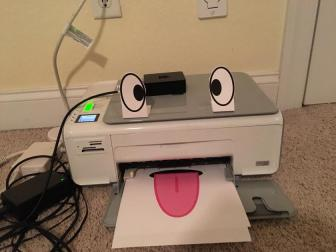

# Printer Bot

Welcome! `Printer Bot` is a discord bot that lives up to it's name: people can print on command via discord to your precious ink consuming compadre. Is that a good Idea? Probably not, but at the same time you should totally do it anyway for reasons.

* print a full discord message up to 2000 characters and have your user's icon appear to the left
* Print as many pictures on a page as your cpu can crunch. Images fit inside a dynamic grid; Stressed tested to hold well over 50 images on one page.
* @mentions - print names of users, bots and roles!
* Cooldowns - limit how many pages users can print at one time.

## Example pages

I get these allot

Images display around 60% of the paper when allowed

An image before user icons were in the top right corner. Shows allot of images on one paper

## Structure

Printer Bot is based on Discord.js; a library for javaScript (More specifically node) that makes building dicord bots easy. To make a paper from discord, we also use jspdf for composing the document, from inserting text to placing images on a grid. Finally, we go outside node.js to use cups for linux as the printing command. Since the actual printing part is a simple command, it can be changed very easily to fit on another operating system to do something else.

Printerbot can run on just about anything; my server is an ancient raspberry Pi B+ attached directly to the printer and also running node. The flexibility of javaScript and apple's CUPS however could let you scale much further, with printers coming from the internet instead of a direct connection and the pi could be replaced by heroku or even a gaming PC.

## Setting up

Setting up printerbot is a piece of cake, your main ingredients are as follows: node, npm, cups, screen, discord.js, jspdf

*note*: The raspberry pi B+ is really old, and therefore did not have node or npm in the raspbian repositories (it uses armv6, which node supports but no builds are available). For this setup I resorted to installing an older version of node and manually moving npm modules from a computer that uses npm.

The recommended way to install node is actually by installing npm first. On debian/ubuntu this is done by:

`sudo apt install npm`

After installing node and npm, run `npm install`; which should install Discord.js and jspdf locally.

You will also need screen which is installed through the same command (`sudo apt install screen`)

### Printer setup

To print, you will need `cups` (`sudo apt install cups`). This was made by apple for their macintosh line, but was later built for Linux to make a protocol that is very compatible for both airprint and unix as a whole.

If you're running printer bot from a desktop linux os you probably already have this setup and configured.

If printerbot doesn't work out of the box... LETS MOVE ON!

Printerbot looks at your default one, if one doesn't exist, the print will fail but a pdf will still save. One of the easiest ways to setup your printer is by going to the cups administration page: yourAddress:631 (e.g 192.168.1.4:631)

From here, go to printers -> [your printer name] -> administration -> set as server default.

This might not work if your printer is not added to cups yet, so instead go to Administration -> Add Printer, and then follow the prompts to add the printer. After this, try following the steups above again to reach your printer.

Cups also has a good collection of commands to configure printing. They are beyond the scope of this document, but your cups setup should come with documentation in both the man pages and the admin webpage. Commands are the faster way to set things up if you can't reach the admin page, you set printers up from memory or you have a script that does this by routine.

### Make a discord bot

Printerbot is hosted by you! In order for him to work, you need to visit Disord's [Developer portal](https://discord.com/developers/applications) and make an app. Click that "New Application" on the top right to get started.

After the app is made, go to the bot menu and add the bot. From here you can add printer bot's name and icon (There's one ready to go in the assets folder if you like :D ) In this menu you will also find your "**Token**", which is your key for your bot to login. Place this inside the string of `token.js` and you should be good.

Next, visit "General Information" and copy your **Client ID**, you will need this to add printer bot to the server.

You should have enough information now to add the bot to discord! Change this link to have your clientId and click on it

https://discord.com/oauth2/authorize?client_id=yourClientIdHere&scope=bot&permissions=10240

The `permissions` section there has a number of 10240, this means it's asking to send messages and manage messages (Deleting a user's message when he uses `/printq`)

## Launching

To launch printerbot, run `./printerScreen.sh` in the root of the project folder. This will launch the bot in the background and away from your terminal, so you can just run this and logout.

To see output from printerbot, just run screen -R and you will hop into it's process. To get out use `ctrl-a-d`, or you can kill the process by hitting `ctrl-c` on your keyboard.

Congratulations! If you see printerbot come online, he should be ready to go on your server!

## Usage

Printerbot has three commands:

* `/printhelp` - Talks about the other two
* `/print` - The primary command. Use this to print text and pictures to paper. Images can be attached, or they can be links to images (png jpeg, jpg, gif).
* `/prinq` - Works the same way as /print but deletes the original message before printing the paper.

## Setting up a secret printing channel

With my group of friends, we decided to create a channel that everyone can use except for me. This way I won't get notifications from printerbot while also preventing me from peeking in and seeing surprises before they print out. To do this, you would need a role that blocks a certain channel. *If you are the server owner, permissions won't work for this and you will probably have to silence notifications for that channel instead.*

1. To start, create a *normal* channel; Once that's done, edit the channel and navigate to Permissions.
1. For this you will need advanced permissions, add the person who will be using printerbot to the permission set and inside advanced permissions, toggle "Read Messages" to off.

Once that is setup, notifications will be blocked, and you'll be at the mercy of discord in terms of sending stuff

## Cooldown times

Cooldown times were set in place to prevent people from spamming you paper. When somebody runs /print or /printq, their printing abilities are turned off until the pre-programmed time is up. As of this writing that cooldown time is **3 hours and 30 mintues**

You can change this frequency by going inside printer.js; look for the line near the top that says "printGroup", and inside you'll find `coolTime`, which has the time in seconds for the next possible print for each user.

Other values in that config:
* `isGroup` specifies that we are inside a group, that means print and printq share these settings and don't need different ones.
* `uses` is how many times the command can be used by one person before they hit a cooldown.
* `glue` tells the cooldown system that every command in this group will create a universal cooldown if each command is used any combination of times to make `uses`'s total. For example, `/a` and `/b` are in a group, `uses` is 5. `/a` is used 2 times and `/b` is used 3. The next time either is run, a cooldown message pops up that applies to both.
* `commands` are which commands have these settings applied to them.

## Things that don't work

* Sometimes google chrome saves jpgs in a more compressed format they built called "webp". JSPDF doesn't like this, and therefore my current workaround at the moment is to block these from coming in. I assume this happens when somebody tries to save an image straight from google photos, but this almost never happens
* Custom emoji

# Special Thanks

THANK YOU EVERYONE in the server of friends I hang out in for making printerbot who he is. It makes me really happy to bring him to life, but it's all thanks to everyone on said server that brought him personality. There are more than a dozen things I wouldn't have imagined getting inked onto a piece of paper, but you know what? I don't regret a single print XD

# License

This work is licensed under a [Creative Commons Attribution 4.0 International License.](http://creativecommons.org/licenses/by/4.0/)